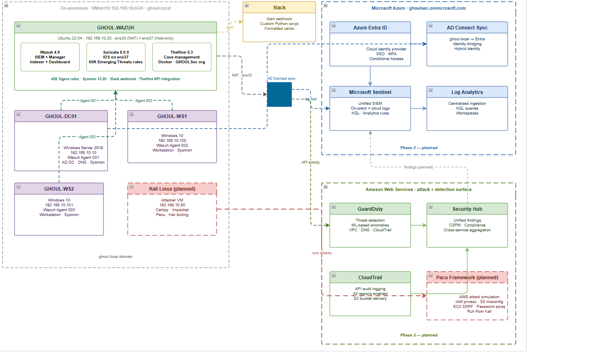

# GHOULSec Home Lab

**Author:** AmintheGHOUL  
**Target Roles:** SOC Analyst · DFIR  
**Status:** Active — Cloud phase complete, attack simulations in progress

A hands-on cybersecurity home lab built to demonstrate practical enterprise attack detection, SIEM engineering, and cloud security skills. Every component mirrors techniques and tools used in real SOC and DFIR work.

---

## Lab Overview



The lab is built in three phases:

| Phase | Description | Status |
|---|---|---|
| **On-Premises** | Active Directory, Wazuh SIEM, Sysmon, Suricata, TheHive | ✅ Complete |
| **Cloud** | Azure Entra ID hybrid identity + AD Connect; AWS GuardDuty, CloudTrail, Security Hub | ✅ Complete |
| **Attack Simulations** | 13 attack scenarios across on-prem and cloud with full detection evidence | 🔄 In Progress |

---

## Architecture

### On-Premises Network

```
192.168.10.0/24  (VMware VMnet1 Host-only)
│
├── GHOUL-DC01   192.168.10.10   Windows Server 2019  Domain Controller
├── GHOUL-WS1    192.168.10.100  Windows 11 LTSC      Workstation (jsmith / IT)
├── GHOUL-WS2    192.168.10.101  Windows 11 LTSC      Workstation (jdoe / Finance)
├── GHOUL-WAZUH  192.168.10.20   Ubuntu 22.04         SIEM / Detection Node
└── Kali         192.168.10.50   Kali Linux           Attacker (pending)
```

### Detection Stack (GHOUL-WAZUH)

| Component | Version | Purpose |
|---|---|---|
| Wazuh | 4.9 | SIEM + EDR — agent manager, alert engine, dashboard |
| Suricata | 8.0.5 | Network IDS on lab interface (ens37) |
| TheHive | 5.3 | Case management — auto-created tickets from Wazuh alerts |
| Sigma Rules | 458 converted | Community Windows attack TTPs via sigWah |
| Sysmon | 15.20 | Extended process and network telemetry on all Windows hosts |

### Cloud Stack

| Platform | Services | Purpose |
|---|---|---|
| **Azure** | Entra ID, AD Connect, Sentinel | Hybrid identity, cloud SIEM |
| **AWS** | CloudTrail, GuardDuty, Security Hub | Cloud-native threat detection |

---

## Attack Scenarios

### On-Premises (MITRE ATT&CK)

| # | Scenario | MITRE | Status |
|---|---|---|---|
| 01 | ClickFix Social Engineering → Initial Access | T1204.002 | Planned |
| 02 | LLMNR Poisoning → NTLMv2 Hash Capture | T1557.001 | Planned |
| 03 | SMB Relay → Remote Shell | T1557.001 | Planned |
| 04 | Kerberoasting → Offline Hash Crack | T1558.003 | Planned |
| 05 | LSASS Dump via LOLBin (comsvcs.dll) | T1003.001 | Planned |
| 06 | DCSync — Full Domain Hash Dump | T1003.006 | Planned |
| 07 | ADCS ESC1 → Certificate Forgery → Domain Admin | T1649 | Planned |
| 08 | Golden Ticket Forgery | T1558.001 | Planned |
| 09 | Silver Ticket Forgery | T1558.002 | Planned |
| 10 | Phantom DLL Hijacking | T1574.001 | Planned |
| 11 | BloodHound AD Recon | T1087.002 | Planned |
| 12 | Pass-the-Hash Lateral Movement | T1550.002 | Planned |
| 13 | CVE-2025-33053 — Stealth Falcon WebDAV RCE via iediagcmd.exe | T1203 | Planned |

### Cloud Scenarios

| # | Scenario | Platform | MITRE | Status |
|---|---|---|---|---|
| C-05 | Password Spray → Entra ID Compromise → Directory Enumeration | Azure | T1110.003 · T1087.004 | ✅ Complete |
| C-06 | Hybrid Identity Bridge: AD Connect → MSOL DCSync Rights | Azure | T1078.002 · T1003.006 | ✅ Complete |
| A-07 | S3 Public Bucket Data Exfiltration | AWS | T1530 | Setup complete |
| A-08 | EC2 IMDSv1 SSRF → Credential Theft | AWS | T1552.005 | Setup complete |
| A-09 | IAM Privilege Escalation via Pacu | AWS | T1078.004 | Setup complete |

---

## Detection Stack in Action

**Wazuh Dashboard — 2,576 alerts indexed, all three Windows agents active:**


**TheHive — Automated cases from Wazuh alerts with severity and MITRE tags:**


**Slack — Real-time formatted alerts to #all-ghoulsec:**


---

## Repository Structure

```
GHOULSec-HomeLab/
│
├── on-prem/
│   ├── dc/
│   │   ├── 01-lab-setup.md              # Full DC and workstation build guide
│   │   └── 02-misconfigurations.md      # Intentional misconfigs with attack paths
│   └── wazuh/
│       ├── GHOULSec_SOC_Lab_Build.md    # Complete Wazuh + TheHive + Slack build
│       └── GHOULSec_Detection_Coverage.md  # Sigma rules, Sysmon, detection engineering
│
├── cloud/
│   ├── azure/
│   │   ├── C-05-Password-Spray-Entra-Recon.md     # MSOLSpray + ROADrecon
│   │   ├── C-06-ADConnect-Hybrid-Identity-Bridge.md # AD Connect → MSOL DCSync
│   │   └── ADConnect-Setup.md                      # Infrastructure setup reference
│   └── aws/
│       └── 03-aws-setup.md              # CloudTrail + GuardDuty + Security Hub + misconfigs
│
├── assets/
│   └── screenshots/                     # All lab screenshots (descriptive filenames)
│
└── docs/
    └── (coming: per-attack write-up templates with log evidence)
```

---

## Key Technical Decisions

**Detection before misconfigs before attacks** — Every phase follows this order. CloudTrail was enabled before any S3 misconfiguration was created. Wazuh was fully operational before attack simulations begin. This mirrors real SOC practice and creates a clean evidence timeline.

**Dual-NIC pattern on GHOUL-WAZUH** — `ens33` NAT for outbound Slack/package updates, `ens37` host-only for lab subnet monitoring. Required for TheHive and Slack integrations without exposing the lab to the internet.

**Official OS images only** — All Windows VMs sourced from Microsoft Evaluation Center and VS Dev Essentials. No community uploads. Security credential hygiene applies to the lab itself.

**Wazuh rule loading order** — `local_rules.xml` loads before the custom rules directory. `if_sid` references to converted Sigma rule IDs must live in the same XML file as those rules, not in `local_rules.xml`.

**TheHive multi-tenancy** — `admin@thehive.local` is platform admin only and cannot create cases. All case and API work requires a dedicated org (GHOULSec), an analyst-profile user, and the `X-Organisation: GHOULSec` header on every API call.

---

## Tools and Versions

| Tool | Version | Use |
|---|---|---|
| VMware Workstation Pro | Latest | Hypervisor |
| Windows Server 2019 | Evaluation | Domain Controller |
| Windows 11 Enterprise LTSC | Evaluation | Workstations |
| Ubuntu | 22.04.5 LTS | SIEM host |
| Wazuh | 4.9 | SIEM / EDR |
| Suricata | 8.0.5 | Network IDS |
| TheHive | 5.3 | Case management |
| Sysmon | 15.20 | Endpoint telemetry |
| Sigma (SigmaHQ) | Current | Detection rules |
| sigWah | Current | Sigma → Wazuh converter |
| Microsoft Sentinel | Current | Azure cloud SIEM |
| AWS GuardDuty | Current | Cloud threat detection |
| Certipy | Current | ADCS attack tooling (planned) |
| Pacu | Current | AWS attack tooling (planned) |
| Kali Linux | Current | Attack platform (pending) |

---

*github.com/AmintheGHOUL/GHOULSec-HomeLab*
