# AWS Detection Infrastructure Setup
## GHOULSec Home Lab — Phase 3

**Author:** Ameen (AmintheGHOUL)  
**Date:** June 2026  
**Account ID:** <your-aws-account-id>  
**Region:** us-east-2 (US East — Ohio)  
**Repo:** github.com/AmintheGHOUL/GHOULSec-HomeLab

---

## Overview

This document covers the AWS phase of GHOULSec — deploying a cloud-native detection stack alongside intentional misconfigurations to simulate real-world attack scenarios. The environment follows the same principle as the on-premises build: **detection infrastructure first, misconfigurations second, attacks last.**

The AWS phase adds three attack scenarios to the lab:

| ID | Scenario | MITRE Technique |
|----|----------|-----------------|
| A-07 | S3 Public Bucket Data Exfiltration | T1530 — Data from Cloud Storage |
| A-08 | EC2 IMDSv1 SSRF → Credential Theft | T1552.005 — Cloud Instance Metadata API |
| A-09 | IAM Privilege Escalation via Pacu | T1078.004 — Valid Accounts: Cloud Accounts |

---

## Stage 1 — Detection Infrastructure

### Architecture

```
AWS Account (<your-aws-account-id>) — us-east-2
│
├── CloudTrail (ghoul-trail)
│     └── S3 bucket: ghoul-cloudtrail-logs
│           All management events, Read + Write
│           Multi-region, log file validation enabled
│
├── GuardDuty
│     Detector ID: <your-guardduty-detector-id>
│     Finding publishing frequency: 15 minutes
│
└── Security Hub
      Standards: AWS Foundational Security Best Practices
                 CIS AWS Foundations Benchmark
```

**Security principle:** Detection was enabled before any misconfigurations were deployed. Every API call made during the misconfiguration setup is captured in CloudTrail — demonstrating the value of enabling logging before anything else exists in the environment.

---

### 1.1 — CloudTrail

**Purpose:** Immutable audit log of every AWS API call across all regions. The forensic backbone of the AWS detection layer — without it, there is no evidence trail for any of the attack scenarios.

**Step 1 — Create the S3 destination bucket**

Before creating the trail, the destination bucket must exist. Created `ghoul-cloudtrail-logs` in us-east-2 with all public access blocked and ACLs disabled (bucket owner enforced).

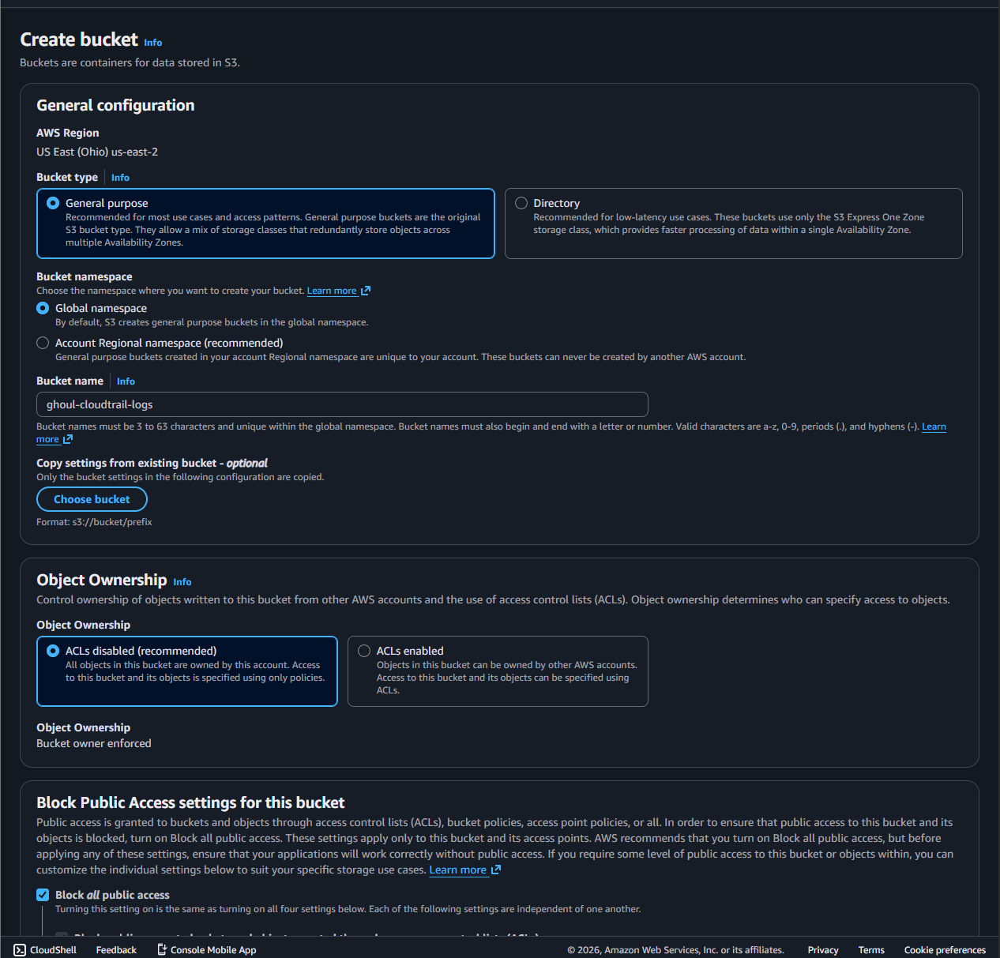

**Step 2 — Create the trail**

Trail `ghoul-trail` created pointing at the existing bucket, with log file validation enabled and SNS notification disabled.

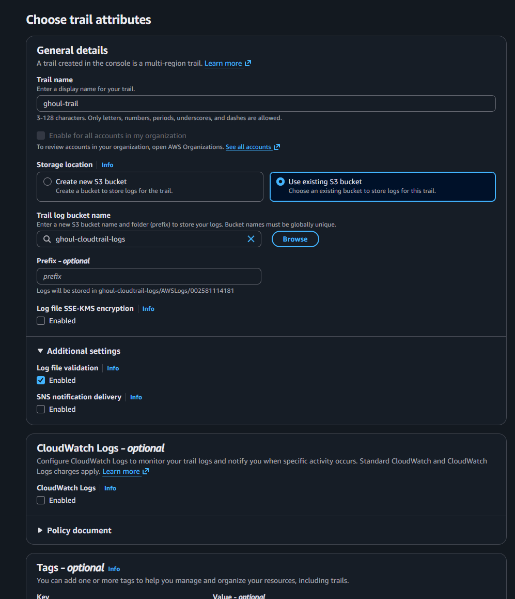

**Step 3 — Configure log events**

Management events enabled for both Read and Write API activity. Data and Insights events disabled to avoid additional charges on a lab account.

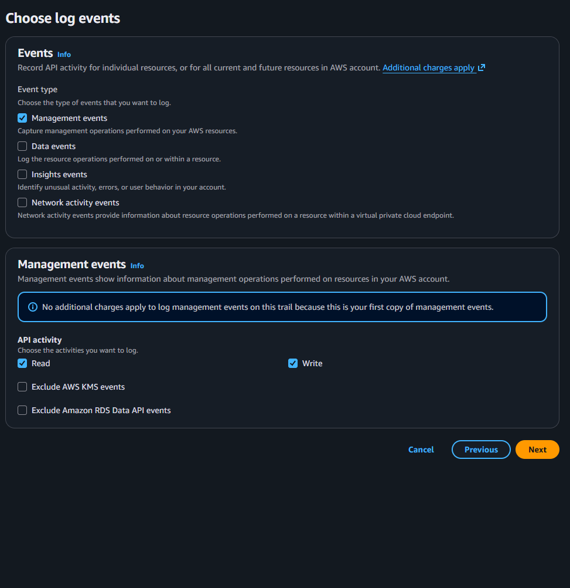

**Trail ARN:** `arn:aws:cloudtrail:us-east-2:<your-aws-account-id>:trail/ghoul-trail`

**Key design decisions:**
- Multi-region trail captures global service events (IAM, STS, CloudFront) regardless of where they originate
- Log file validation creates a SHA-256 digest file every hour — if a log file is deleted or modified, the digest chain breaks and tampering is detectable
- S3 bucket kept fully private with block public access enforced — contrast with the intentionally public `ghoul-public-data` bucket created in Stage 2

---

### 1.2 — GuardDuty

**Purpose:** AWS-managed threat detection service. Analyses CloudTrail logs, VPC Flow Logs, and DNS logs using ML-based anomaly detection and threat intelligence feeds. Fires findings for credential abuse, recon activity, C2 communication, and data exfiltration patterns.

**Setup:**

1. Navigated to GuardDuty → Get Started → Enable GuardDuty (30-day free trial)
2. Navigated to Settings → changed finding publishing frequency to **15 minutes**
   - Default is 6 hours — too slow for a lab environment where attacks and detections happen in the same session

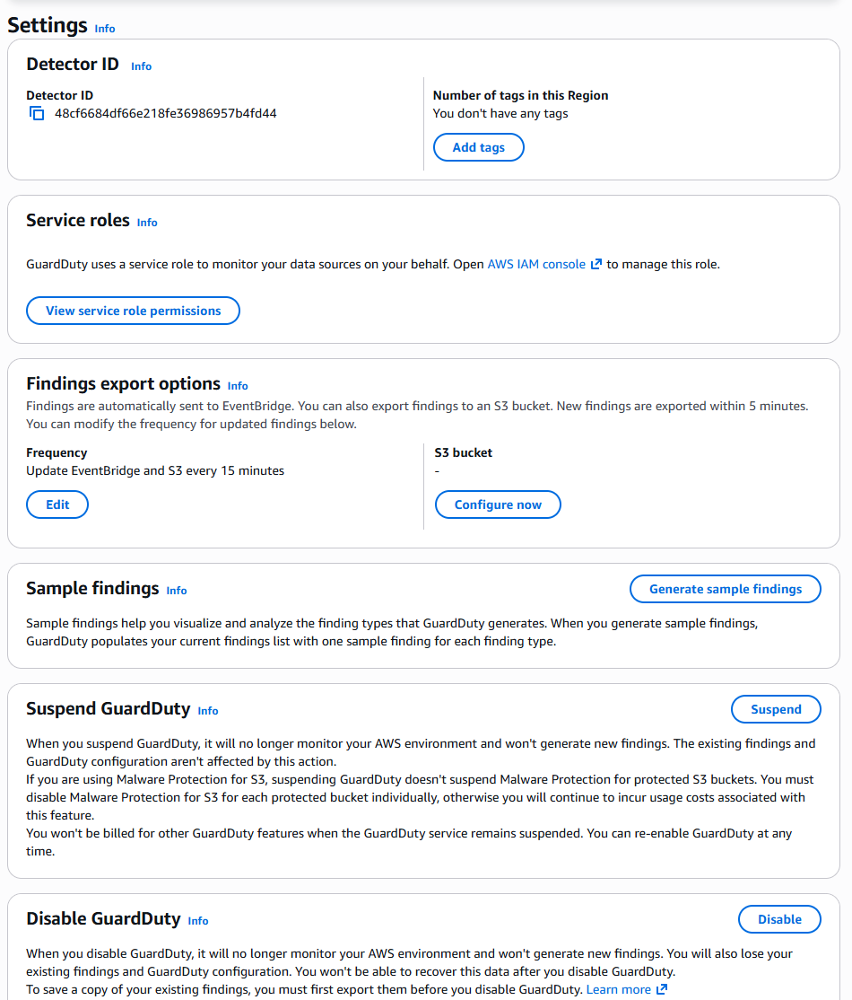

**Detector ID:** `<your-guardduty-detector-id>`

**Findings expected during attack scenarios:**

| Attack | Expected GuardDuty Finding |
|--------|---------------------------|
| A-07 (S3 public bucket access) | `Policy:S3/BucketBlockPublicAccessDisabled` |
| A-07 (unauthenticated access from Kali) | `Discovery:S3/MaliciousIPCaller` |
| A-08 (IMDS credential exfiltration) | `UnauthorizedAccess:IAMUser/InstanceCredentialExfiltration.OutsideAWS` |
| A-09 (IAM privesc) | `PrivilegeEscalation:IAMUser/AdministrativePermissions` |

**Note:** GuardDuty baselines account behaviour over ~24 hours. Anomaly-based findings become more reliable after the baseline period. Findings based on known-bad IPs and threat intelligence fire immediately.

---

### 1.3 — Security Hub

**Purpose:** Aggregates findings from GuardDuty, CloudTrail, and other AWS services into a single prioritised view. Also runs the CIS AWS Foundations Benchmark and AWS Foundational Security Best Practices checks against the account continuously.

**Setup:**

Selected **Enable all capabilities** with the 30-day free trial. Both default standards enabled automatically.

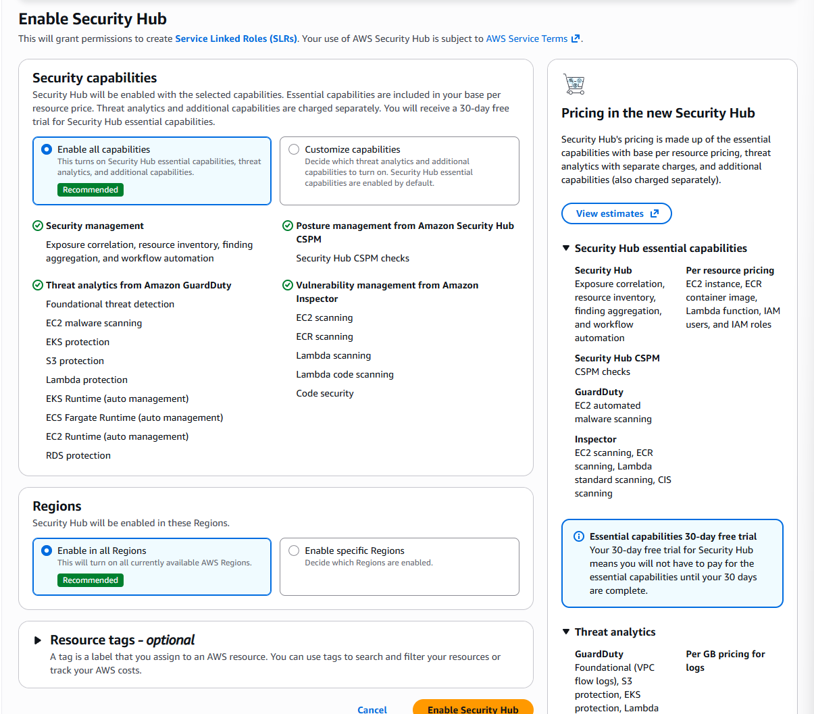

**Standards enabled:**
- AWS Foundational Security Best Practices v1.0.0
- CIS AWS Foundations Benchmark

**Portfolio note:** A fresh AWS account with intentional misconfigurations will generate a significant number of CIS benchmark failures immediately after Security Hub is enabled. These findings are the **"before" state** — documented here as the baseline prior to running attack simulations and applying remediations.

---

## Stage 2 — Intentional Misconfigurations

### 2.1 — A-07: S3 Public Bucket

**Resource:** `ghoul-public-data` (us-east-2)  
**MITRE:** T1530 — Data from Cloud Storage Object  
**Simulates:** Accidental public exposure of sensitive data — one of the most common real-world AWS misconfigurations

**Step 1 — Create the bucket with public access enabled**

Object Ownership set to ACLs enabled (Bucket owner preferred). Block Public Access unchecked entirely.

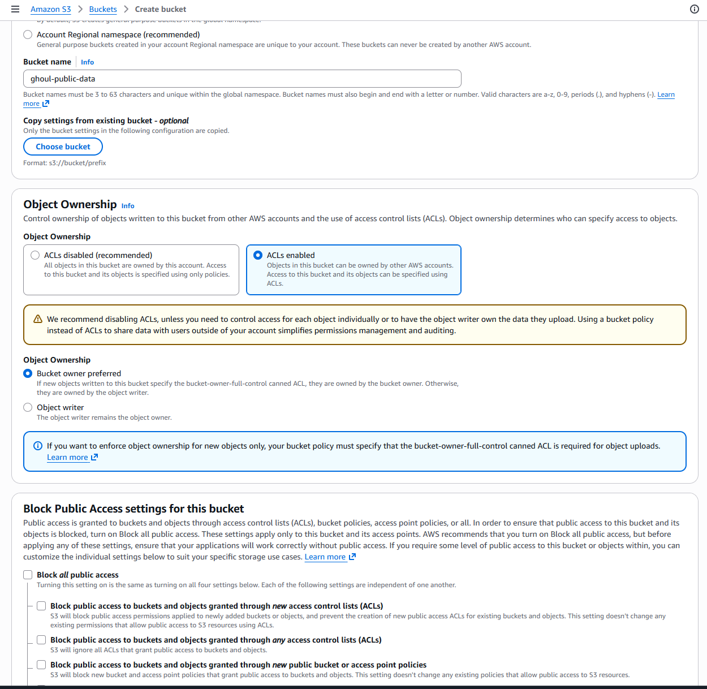

**Step 2 — Upload fake sensitive data**

`credentials.txt` uploaded to the bucket root — contains simulated database credentials and AWS access keys to demonstrate what an attacker would find.

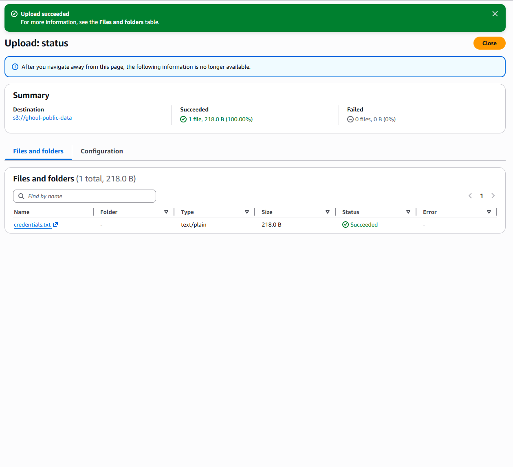

**Step 3 — Apply public ACL**

Bucket ACL set to grant Everyone (public access) List and Read permissions on objects.

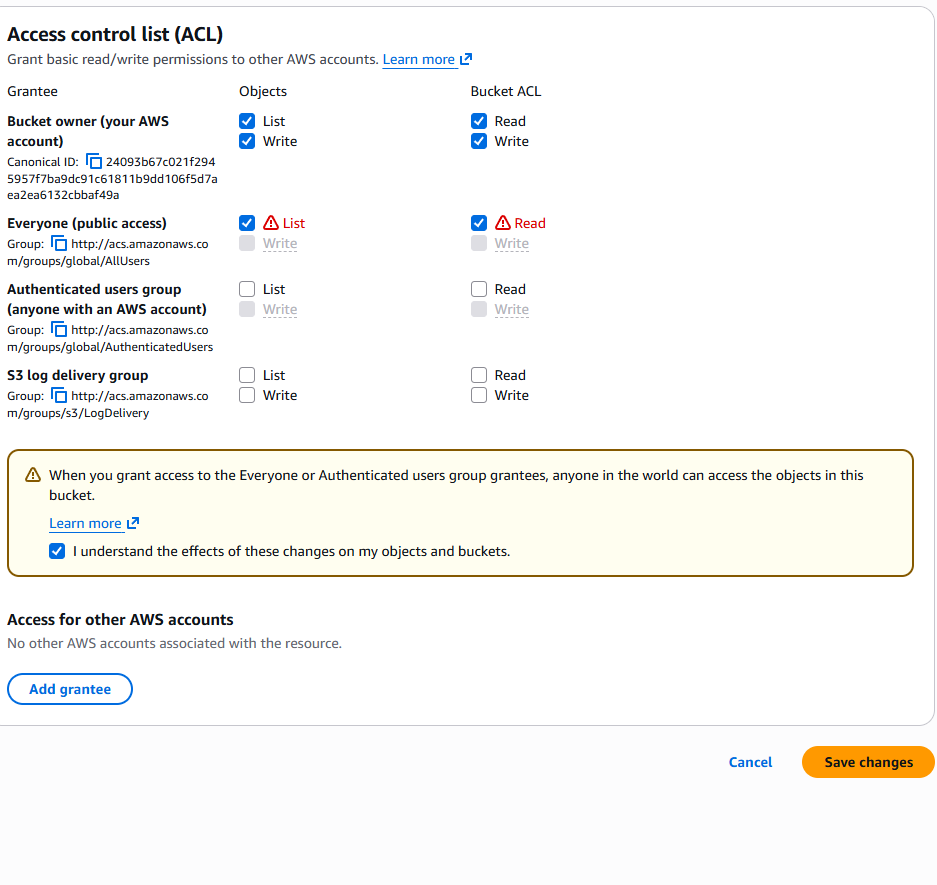

**Step 4 — Apply bucket policy**

Bucket policy set to allow unauthenticated `s3:GetObject` for all principals (`*`).

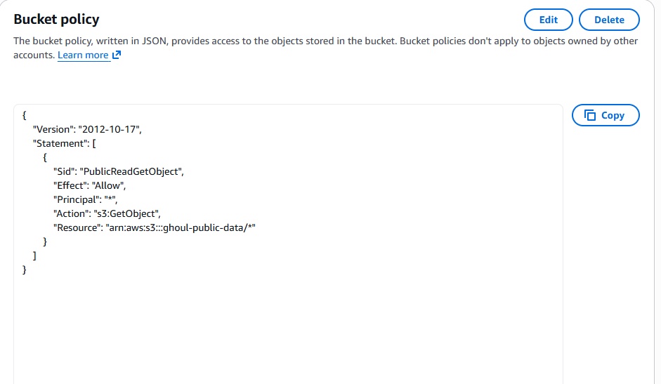

**Bucket policy applied:**
```json
{
  "Version": "2012-10-17",
  "Statement": [
    {
      "Sid": "PublicReadGetObject",
      "Effect": "Allow",
      "Principal": "*",
      "Action": "s3:GetObject",
      "Resource": "arn:aws:s3:::ghoul-public-data/*"
    }
  ]
}
```

**Verification:** File accessible unauthenticated at:
```
https://ghoul-public-data.s3.us-east-2.amazonaws.com/credentials.txt
```

**Why both ACL and bucket policy?**  
ACL alone is insufficient on modern AWS accounts — the bucket policy is what actually enforces public read access for `GetObject`. This reflects real-world misconfigurations where multiple access control layers are incorrectly configured simultaneously.

---

### 2.2 — A-08: EC2 IMDSv1 Vulnerable Instance

**Resource:** `ghoul-vulnerable-imds` (us-east-2, t2.micro)  
**MITRE:** T1552.005 — Unsecured Credentials: Cloud Instance Metadata API  
**Simulates:** The Capital One breach (2019) attack pattern — SSRF via web app vulnerability hitting the unprotected metadata service

**Step 1 — Create the IAM role**

`GhoulEC2Role` created with EC2 as the trusted entity and `ReadOnlyAccess` attached — an overpermissive role representing a common real-world mistake.

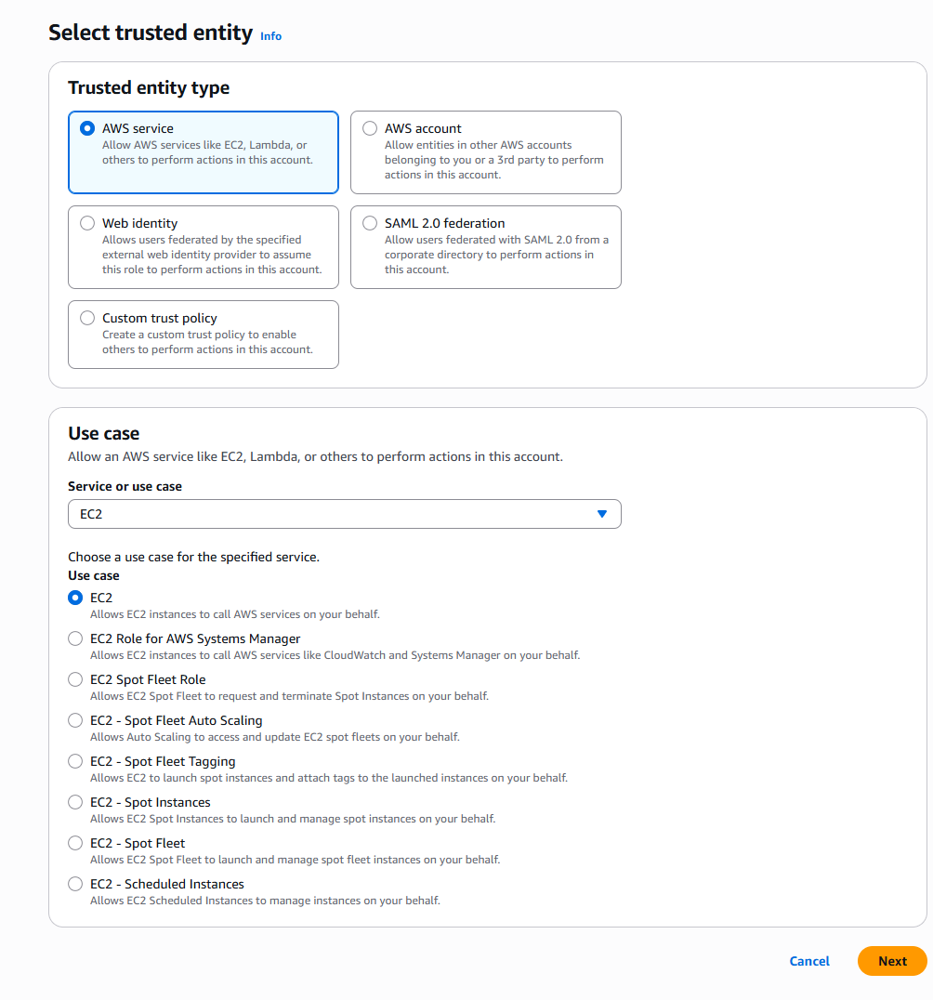

**IMDSv1 vs IMDSv2 — the vulnerability explained:**

| | IMDSv1 (vulnerable) | IMDSv2 (secure) |
|--|---------------------|-----------------|
| Authentication | None — any GET request works | Requires PUT preflight to get session token |
| SSRF exploitable | ✅ Yes | ❌ No — SSRF can't make PUT requests |
| Hop limit | Set to 2 (allows container pivoting) | Set to 1 (default secure) |

**Metadata settings applied to EC2 instance:**
- Metadata accessible: Enabled
- Metadata version: **V1 and V2 (token optional)** ← the vulnerable setting
- Hop limit: 2

**Attack command (to be executed during A-08 simulation):**
```bash
# From inside the EC2 or via SSRF — no authentication required with IMDSv1
curl http://169.254.169.254/latest/meta-data/iam/security-credentials/GhoulEC2Role
```
Returns temporary `AccessKeyId`, `SecretAccessKey`, and `SessionToken` — usable immediately from any machine.

**Comparison to Azure IMDS (C-04):**  
The Azure IMDS attack (C-04) required the `Metadata: true` header — a small but meaningful barrier that blocks basic SSRF tools. AWS IMDSv1 requires no headers whatsoever, making it more easily exploitable via unsophisticated SSRF vulnerabilities.

> **Operational note:** EC2 launch was initially blocked by an AWS new account verification hold — a fraud prevention mechanism on newly created accounts. Resolved via AWS support within a few hours. Documented here as a real-world troubleshooting example relevant to any analyst setting up a new cloud environment.

---

### 2.3 — A-09: IAM Privilege Escalation Chain

**MITRE:** T1078.004 — Valid Accounts: Cloud Accounts / T1098 — Account Manipulation  
**Tool:** Pacu (AWS exploitation framework)  
**Simulates:** Compromised low-privilege credentials escalating to administrator — the most impactful IAM attack pattern

**Step 1 — Create dev-lowpriv with IAMReadOnlyAccess**

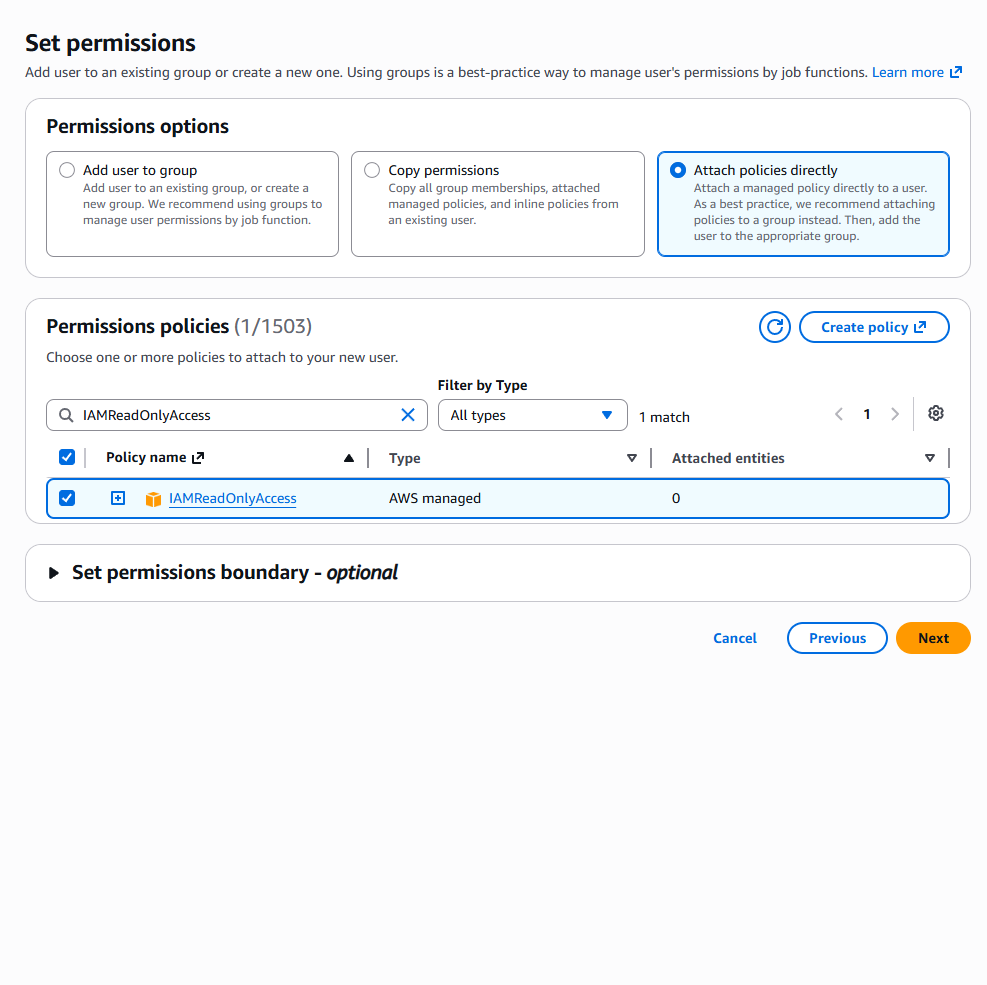

**Step 2 — Add the misconfigured inline policy**

`DevMisconfiguredPolicy` added as an inline policy granting `iam:AttachUserPolicy` and `iam:PutUserPolicy` on all resources.

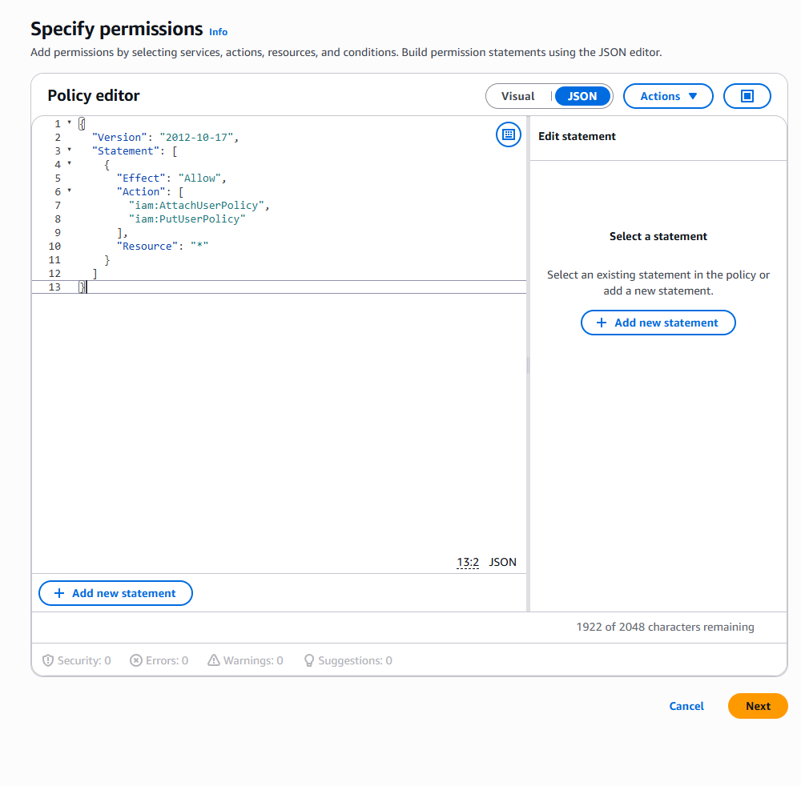

**Users created:**

| User | Policies | Purpose |
|------|----------|---------|
| `dev-lowpriv` | IAMReadOnlyAccess + DevMisconfiguredPolicy (inline) | Pacu starting credential |
| `dev-deploy` | AdministratorAccess | Escalation target |

**The misconfiguration — DevMisconfiguredPolicy:**
```json
{
  "Version": "2012-10-17",
  "Statement": [
    {
      "Effect": "Allow",
      "Action": [
        "iam:AttachUserPolicy",
        "iam:PutUserPolicy"
      ],
      "Resource": "*"
    }
  ]
}
```

**Why this is dangerous:**  
`iam:AttachUserPolicy` with `Resource: *` allows `dev-lowpriv` to attach **any policy** — including `AdministratorAccess` — to **any user**, including itself. Combined with `IAMReadOnlyAccess` (which allows enumeration of existing policies and users), this gives Pacu everything it needs to identify and execute the escalation path automatically.

**This pattern appears in real environments** when developers are given IAM management permissions to "manage their own team's access" without understanding that `iam:AttachUserPolicy` on `*` is effectively full admin access.

**Pacu escalation path (to be executed during A-09 simulation):**
```bash
pacu
> import_keys dev-lowpriv
> run iam__enum_permissions
> run iam__privesc_scan
# Pacu identifies iam:AttachUserPolicy as escalation vector
> run iam__privesc_exploit --technique ATTACH_POLICY
```

**CloudTrail evidence generated:**
- `ListUsers` — enumeration
- `ListAttachedUserPolicies` — permission discovery
- `AttachUserPolicy` — the escalation action
- `CreateAccessKey` — persistence after escalation

---

## Detection Summary

| Scenario | CloudTrail Event | GuardDuty Finding | Security Hub |
|----------|-----------------|-------------------|--------------|
| A-07 | `GetObject` from unauthenticated principal | `Discovery:S3/MaliciousIPCaller` | S3.2 — Block Public Access |
| A-08 | `AssumeRole` from unexpected IP | `UnauthorizedAccess:IAMUser/InstanceCredentialExfiltration` | EC2 IMDS finding |
| A-09 | `AttachUserPolicy` by low-priv user | `PrivilegeEscalation:IAMUser/AdministrativePermissions` | IAM.1 — Root MFA |

---

## Resources

| Resource | Type | Purpose |
|----------|------|---------|
| `ghoul-trail` | CloudTrail trail | All API audit logging |
| `ghoul-cloudtrail-logs` | S3 bucket (private) | CloudTrail log storage |
| `ghoul-public-data` | S3 bucket (public) | A-07 misconfiguration target |
| `GhoulEC2Role` | IAM role | A-08 overpermissive EC2 role |
| `ghoul-vulnerable-imds` | EC2 t2.micro | A-08 IMDSv1 vulnerable instance |
| `dev-lowpriv` | IAM user | A-09 Pacu starting credential |
| `dev-deploy` | IAM user | A-09 escalation target |

---

## Screenshot Index

| Filename | Description |
|----------|-------------|
| `aws-01-cloudtrail-bucket-create.png` | CloudTrail S3 bucket creation — ghoul-cloudtrail-logs |
| `aws-02-cloudtrail-trail-config.png` | Trail configuration — name, bucket, log file validation |
| `aws-03-cloudtrail-log-events.png` | Log events — management events Read + Write selected |
| `aws-04-guardduty-settings.png` | GuardDuty Settings — Detector ID, 15-minute frequency |
| `aws-05-securityhub-enable.png` | Security Hub enable screen — capabilities and standards |
| `aws-06-s3-public-bucket-create.png` | S3 bucket creation — ACLs enabled, public access unblocked |
| `aws-07-s3-upload-success.png` | S3 upload confirmation — credentials.txt in ghoul-public-data |
| `aws-08-s3-acl-everyone.png` | S3 ACL — Everyone granted List and Read |
| `aws-09-s3-bucket-policy.png` | S3 bucket policy — PublicReadGetObject |
| `aws-10-iam-ec2-role-trust.png` | IAM role — EC2 trusted entity, ReadOnlyAccess attached |
| `aws-11-iam-devlowpriv-readonly.png` | dev-lowpriv — IAMReadOnlyAccess attached |
| `aws-12-iam-devlowpriv-inline-policy.png` | DevMisconfiguredPolicy — iam:AttachUserPolicy inline |

> Place all screenshots in `../../assets/screenshots/` relative to this document in the repo.

---

*Next: Attack simulations — A-07, A-08, A-09 execution with full log evidence and GuardDuty findings*
