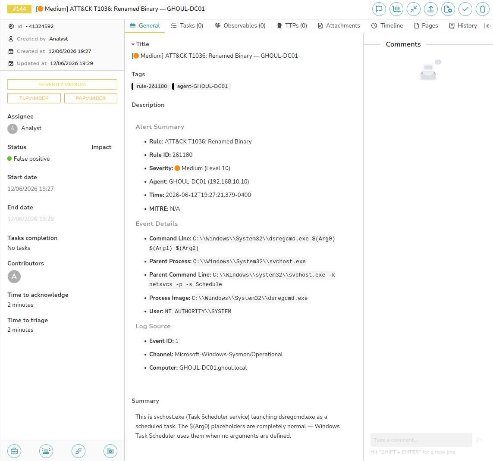
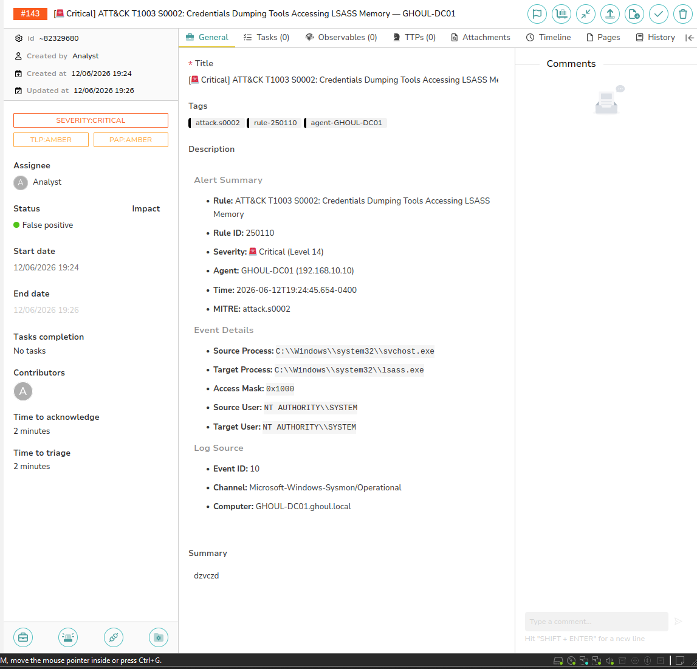

# GHOULSec Home Lab — SOC Build Guide

**GitHub:** AmintheGHOUL | **Lab Domain:** ghoul.local | **Subnet:** 192.168.10.0/24

> This guide documents the full build of the GHOULSec SOC Home Lab — a hands-on detection and response environment targeting SOC Analyst and DFIR roles. Every component is free or open-source. Follow each section in order.

---

## Lab In Action

Screenshots taken during live operation of the completed GHOULSec stack.

**Wazuh Dashboard — 2,576 alerts indexed across 24 hours, all three Windows agents reporting:**



**TheHive — Automated cases created from Wazuh alerts, severity-classified with MITRE tags:**



**Slack — Real-time formatted alerts firing to #all-ghoulsec on high/critical detections:**


---

## Table of Contents

1. [Lab Architecture](#1-lab-architecture)
2. [Ubuntu 22.04 Installation](#2-ubuntu-2204-installation)
3. [System Baseline](#3-system-baseline)
4. [Wazuh Installation](#4-wazuh-installation)
5. [Suricata Installation](#5-suricata-installation)
6. [Suricata → Wazuh Integration](#6-suricata--wazuh-integration)
7. [TheHive Installation](#7-thehive-installation)
8. [Slack Webhook Setup](#8-slack-webhook-setup)
9. [Network Configuration (Dual NIC)](#9-network-configuration-dual-nic)
10. [Wazuh Agent Deployment](#10-wazuh-agent-deployment)
11. [Wazuh → TheHive Integration](#11-wazuh--thehive-integration)
12. [Alert Pipeline Summary](#12-alert-pipeline-summary)

---

## 1. Lab Architecture

### Network Topology

| Machine | IP | OS | Role |
|---|---|---|---|
| GHOUL-DC01 | 192.168.10.10 | Windows Server 2019 | Domain Controller (ghoul.local) |
| GHOUL-WAZUH | 192.168.10.20 | Ubuntu 22.04.5 LTS | SIEM / Detection Node |
| GHOUL-WS1 | 192.168.10.100 | Windows 11 Enterprise LTSC | Workstation — jsmith (IT) |
| GHOUL-WS2 | 192.168.10.101 | Windows 11 Enterprise LTSC | Workstation — jdoe (Finance) |

### GHOUL-WAZUH VM Specs

| Resource | Value |
|---|---|
| RAM | 8 GB |
| Disk | 100 GB |
| Network Adapter 1 | NAT (internet — for Slack webhooks and package updates) |
| Network Adapter 2 | Host-only (192.168.10.20 — lab subnet) |

### Software Stack

| Component | Purpose |
|---|---|
| Wazuh 4.9 | SIEM + EDR — detection engine and agent manager |
| Suricata 8.0.5 | Network IDS — traffic analysis on lab interface |
| TheHive 5.3 | Case management — alert tickets and investigation tracking |
| Slack | Real-time alert delivery to #all-ghoulsec channel |

---

## 2. Ubuntu 22.04 Installation

### Download

Download the official Ubuntu 22.04.5 LTS Desktop ISO from the Ubuntu releases server:

**https://releases.ubuntu.com/22.04/**

File: `ubuntu-22.04.5-desktop-amd64.iso`

> Use Ubuntu 22.04 LTS specifically. Wazuh 4.9 is tested and supported on this release. Ubuntu 26.04 is not yet supported by the Wazuh indexer.

### VM Creation (VMware)

1. Create a new VM — select the downloaded ISO
2. Set RAM to **8 GB**, disk to **100 GB**
3. Set network adapter to **NAT** for the initial install (internet access needed)
4. Boot and follow the Ubuntu installer

### Account Setup (Installer Screen)

When the installer reaches the "Create your account" screen:

- **Your name:** your preferred display name
- **Computer's name:** `GHOUL-WAZUH`
- **Username:** your chosen username
- **Uncheck "Use Active Directory"** — this VM is a standalone detection box, not a domain member

### Verify Installation

After booting into the desktop, open a terminal and confirm:

```bash
lsb_release -a
```

Expected output:
```
Distributor ID: Ubuntu
Description:    Ubuntu 22.04.5 LTS
Release:        22.04
Codename:       jammy
```

---

## 3. System Baseline

### Update the System

```bash
sudo apt update && sudo apt upgrade -y
```

### Install Required Dependencies

```bash
sudo apt install -y curl wget gnupg2 apt-transport-https ca-certificates net-tools python3-pip
```

### Kernel Tuning for OpenSearch

Wazuh uses OpenSearch as its indexer. OpenSearch requires a higher virtual memory map count or it will silently fail to start.

Set it for the current session:

```bash
sudo sysctl -w vm.max_map_count=262144
```

Make it permanent across reboots:

```bash
echo "vm.max_map_count=262144" | sudo tee -a /etc/sysctl.conf
```

Verify:

```bash
sysctl vm.max_map_count
# Expected output: vm.max_map_count = 262144
```

---

## 4. Wazuh Installation

Wazuh is deployed as an all-in-one installation — Manager, Indexer (OpenSearch), and Dashboard on the same machine.

### Download Installation Files

```bash
cd ~/Desktop
curl -sO https://packages.wazuh.com/4.9/wazuh-install.sh
curl -sO https://packages.wazuh.com/4.9/config.yml
```

### Configure Node IPs

Edit `config.yml` and replace all three IP placeholders with `192.168.10.20`:

```bash
nano config.yml
```

The file should look like this after editing:

```yaml
nodes:
  indexer:
    - name: node-1
      ip: "192.168.10.20"

  server:
    - name: wazuh-1
      ip: "192.168.10.20"

  dashboard:
    - name: dashboard
      ip: "192.168.10.20"
```

> All three nodes point to the same IP because this is a single-node all-in-one deployment.

### Run the Installer

```bash
sudo bash wazuh-install.sh -a
```

The installer will:
1. Generate SSL certificates
2. Deploy and configure OpenSearch (Wazuh Indexer)
3. Install and configure Wazuh Manager
4. Install and configure Filebeat
5. Deploy the Wazuh Dashboard

This takes approximately 5–10 minutes. When complete, the installer prints credentials:

```
INFO: --- Summary ---
INFO: You can access the web interface https://192.168.10.20
    User: admin
    Password: <GENERATED_PASSWORD>
```

**Save the generated admin password immediately.**

### Validate Services

```bash
sudo systemctl status wazuh-manager wazuh-indexer wazuh-dashboard filebeat --no-pager
```

All four services must show `active (running)`.

Verify OpenSearch is healthy:

```bash
curl -k -u admin:<PASSWORD> https://192.168.10.20:9200/_cluster/health?pretty
```

### Access the Dashboard

Open a browser and navigate to:

```
https://127.0.0.1
```

Accept the self-signed certificate warning. Log in with `admin` and the generated password.

> Once the VM is moved to the lab subnet, the dashboard will be accessible from any lab machine at `https://192.168.10.20`.

---

## 5. Suricata Installation

Suricata runs as a network IDS, monitoring traffic on the lab interface and generating EVE JSON alerts that Wazuh ingests.

### Add the OISF PPA

```bash
sudo add-apt-repository ppa:oisf/suricata-stable -y
```

### Install Suricata

```bash
sudo apt update && sudo apt install -y suricata
```

### Find the Network Interface

```bash
ip a
```

Note the interface name — in this lab it is `ens33` (NAT) during install. After the dual NIC is configured, Suricata will monitor `ens37` (the lab interface). Adjust accordingly.

### Configure Suricata

```bash
sudo nano /etc/suricata/suricata.yaml
```

Use `Ctrl+W` to search within nano.

**Set the interface** — search for `af-packet`:

```yaml
af-packet:
  - interface: ens37
```

**Enable Community ID** — search for `community-id`:

```yaml
community-id: true
```

Community ID enables correlation between Suricata alerts and other tools (Zeek, Wazuh, etc.).

### Download Rules

```bash
sudo suricata-update
```

This downloads the Emerging Threats Open ruleset. Expected output:

```
Loaded 66664 rules.
Writing rules to /var/lib/suricata/rules/suricata.rules
```

### Start and Enable Suricata

```bash
sudo systemctl enable --now suricata
sudo systemctl status suricata --no-pager
```

---

## 6. Suricata → Wazuh Integration

Wazuh natively ingests Suricata's EVE JSON log file. Add a `localfile` stanza to `ossec.conf` so Wazuh Manager tails it.

```bash
sudo nano /var/ossec/etc/ossec.conf
```

Add the following block just before the closing `</ossec_config>` tag:

```xml
<localfile>
  <log_format>json</log_format>
  <location>/var/log/suricata/eve.json</location>
</localfile>
```

Restart Wazuh Manager to apply:

```bash
sudo systemctl restart wazuh-manager
```

Verify Suricata alerts are being parsed by triggering test traffic:

```bash
curl http://testmynids.us/uid/index.html
sudo tail /var/log/suricata/fast.log
```

---

## 7. TheHive Installation

TheHive is the case management platform where Wazuh alerts become investigation tickets. It is deployed as a Docker container to control memory usage on an 8 GB host.

### Install Docker

```bash
curl -fsSL https://get.docker.com | sudo sh
sudo usermod -aG docker $USER
newgrp docker
```

Verify:

```bash
docker --version
```

### Create TheHive Directory

```bash
mkdir ~/thehive && cd ~/thehive
```

Create a local data directory with the correct ownership (TheHive runs as uid 1000):

```bash
mkdir -p ~/thehive/data
sudo chown -R 1000:1000 ~/thehive/data
```

### Create the Docker Compose File

```bash
nano docker-compose.yml
```

Paste the following:

```yaml
services:
  thehive:
    image: strangebee/thehive:5.3
    mem_limit: 2g
    restart: unless-stopped
    ports:
      - "9000:9000"
    environment:
      - JVM_OPTS=-Xms512M -Xmx1536M
    command:
      - --secret
      - "GHOULSecTheHiveSecret2024"
    volumes:
      - ./data:/data/db
```

> `mem_limit: 2g` caps TheHive's memory to protect Wazuh's OpenSearch which also needs significant RAM on an 8 GB host.

### Start TheHive

```bash
docker compose up -d
```

Verify the container is running:

```bash
docker ps
```

The container should show `Up` status with port `0.0.0.0:9000->9000/tcp`.

### Access TheHive

Open a browser and navigate to:

```
http://127.0.0.1:9000
```

> TheHive may take 60–90 seconds to fully initialize on first boot.

Default login credentials:

```
Username: admin@thehive.local
Password: secret
```

### Enable Docker Auto-restart

The `restart: unless-stopped` policy in the compose file ensures TheHive starts automatically on VM reboot.

---

## 8. Slack Webhook Setup

Slack provides real-time alert notifications when Wazuh detects high-severity events.

### Create a Slack Workspace

1. Go to **https://slack.com/get-started** on your host machine browser
2. Sign up and create a workspace (e.g. `GHOULSec`)
3. Create a channel called `#ghoul-alerts` or use an existing channel

### Create a Slack App and Webhook

1. Go to **https://api.slack.com/apps**
2. Click **Create New App → From scratch**
3. Name it `Wazuh Alerts`, select your workspace
4. In the left sidebar under **Features**, click **Incoming Webhooks**
5. Toggle **Activate Incoming Webhooks** to **On**
6. Click **Add New Webhook to Workspace**
7. Select your alerts channel and click **Allow**
8. Copy the webhook URL — it looks like `https://hooks.slack.com/services/XXXXX/XXXXX/XXXXX`

### Test the Webhook

Run this from GHOUL-WAZUH to confirm the webhook is working:

```bash
curl -X POST -H 'Content-type: application/json' \
  --data '{"text":"GHOULSec test alert — webhook working!"}' \
  https://hooks.slack.com/services/YOUR/WEBHOOK/URL
```

Expected response: `ok`

Check your Slack channel for the test message.

### Configure Wazuh → Slack Integration

The built-in Slack integration sends raw JSON which is unreadable. Use a custom Python script instead that sends clean formatted messages. Create the script:

```bash
sudo tee /var/ossec/integrations/custom-slack << 'EOF'
#!/usr/bin/env python3
import sys
import json
import requests

SLACK_WEBHOOK = "https://hooks.slack.com/services/YOUR/WEBHOOK/URL"

def get_severity_emoji(level):
    level = int(level)
    if level <= 9: return "🟡"
    elif level <= 11: return "🟠"
    elif level <= 13: return "🔴"
    else: return "🚨"

def get_severity_label(level):
    level = int(level)
    if level <= 9: return "LOW"
    elif level <= 11: return "MEDIUM"
    elif level <= 13: return "HIGH"
    else: return "CRITICAL"

def get_mitre(groups):
    return [g for g in groups if g.startswith("attack.t") or g.startswith("attack.s")]

def build_slack_message(alert):
    rule = alert.get("rule", {})
    agent = alert.get("agent", {})
    eventdata = alert.get("data", {}).get("win", {}).get("eventdata", {})
    system = alert.get("data", {}).get("win", {}).get("system", {})
    level = rule.get("level", 0)
    mitre = get_mitre(rule.get("groups", []))

    text = f"{get_severity_emoji(level)} *WAZUH ALERT — {get_severity_label(level)}*\n"
    text += f"*{rule.get('description', 'Unknown Rule')}*\n\n"
    text += f"• *Agent:* `{agent.get('name', 'N/A')}` ({agent.get('ip', 'N/A')})\n"
    text += f"• *Rule ID:* {rule.get('id', 'N/A')} | *Level:* {level}\n"
    text += f"• *Time:* {alert.get('timestamp', 'N/A')}\n"
    if mitre:
        text += f"• *MITRE:* {', '.join(mitre)}\n"

    for field, label in {"sourceImage":"Source Process","targetImage":"Target Process","commandLine":"Command Line","parentImage":"Parent Process","image":"Process","grantedAccess":"Access Mask","destinationIp":"Dest IP","sourceUser":"User","user":"User"}.items():
        val = eventdata.get(field)
        if val:
            text += f"• *{label}:* `{val}`\n"

    event_id = system.get("eventID")
    if event_id:
        text += f"• *Event ID:* {event_id} | *Channel:* {system.get('channel', 'N/A')}"
    return text

def main():
    try:
        alert = json.load(open(sys.argv[1]))
        if int(alert.get("rule", {}).get("level", 0)) < 12:
            sys.exit(0)
        requests.post(SLACK_WEBHOOK, json={"text": build_slack_message(alert)}, timeout=10)
    except Exception as e:
        open("/var/ossec/logs/slack-integration.log", "a").write(f"Error: {str(e)}\n")
        sys.exit(1)

if __name__ == "__main__":
    main()
EOF
```

Set permissions:

```bash
sudo chmod 755 /var/ossec/integrations/custom-slack
sudo chown root:wazuh /var/ossec/integrations/custom-slack
```

Add to `ossec.conf`:

```xml
<integration>
  <name>custom-slack</name>
  <hook_url>https://hooks.slack.com/services/YOUR/WEBHOOK/URL</hook_url>
  <level>12</level>
  <alert_format>json</alert_format>
</integration>
```

> Replace `YOUR/WEBHOOK/URL` with your actual Slack webhook URL. Level 12 means only High and Critical alerts fire to Slack.

Restart Wazuh Manager:

```bash
sudo systemctl restart wazuh-manager
```

Verify `wazuh-integratord` is running:

```bash
sudo systemctl status wazuh-manager --no-pager | grep integratord
```

---

## 9. Network Configuration (Dual NIC)

GHOUL-WAZUH needs two network interfaces:

- **ens33** — NAT — internet access for Slack webhooks and package updates
- **ens37** — Host-only — lab subnet (192.168.10.0/24) for agent communication

### Add Second Network Adapter in VMware

1. Shut down the VM: `sudo shutdown now`
2. In VMware: **VM → Settings → Add → Network Adapter**
3. Set the new adapter to **Host-only**
4. Power the VM back on

### Configure Static IP on the Lab Interface

Create a new netplan configuration file:

```bash
sudo nano /etc/netplan/01-lab-network.yaml
```

Add the following:

```yaml
network:
  version: 2
  ethernets:
    ens37:
      dhcp4: no
      addresses: [192.168.10.20/24]
```

Fix permissions and apply:

```bash
sudo chmod 600 /etc/netplan/01-lab-network.yaml
sudo netplan apply
```

Verify the IP is assigned:

```bash
ip a show ens37
```

Expected output should include `inet 192.168.10.20/24`.

### Update Suricata to Monitor the Lab Interface

If Suricata was previously configured on `ens33`, update it to monitor `ens37`:

```bash
sudo nano /etc/suricata/suricata.yaml
```

Change the `af-packet` interface to `ens37`, then restart:

```bash
sudo systemctl restart suricata
```

---

## 10. Wazuh Agent Deployment

Wazuh agents are installed on each Windows machine and report to the GHOUL-WAZUH manager at `192.168.10.20`.

### Serve the Agent Installer

On GHOUL-WAZUH, download the Windows agent MSI and serve it over HTTP:

```bash
cd ~/Desktop
wget https://packages.wazuh.com/4.x/windows/wazuh-agent-4.9.0-1.msi
python3 -m http.server 8080
```

Leave the HTTP server running during agent deployment.

### Deploy on GHOUL-DC01

On **GHOUL-DC01**, open PowerShell as Administrator:

```powershell
Invoke-WebRequest -Uri http://192.168.10.20:8080/wazuh-agent-4.9.0-1.msi -OutFile wazuh-agent.msi
msiexec.exe /i wazuh-agent.msi /q WAZUH_MANAGER="192.168.10.20" WAZUH_AGENT_NAME="GHOUL-DC01"
NET START WazuhSvc
```

### Deploy on GHOUL-WS1 and GHOUL-WS2

For domain workstations, deploy remotely from GHOUL-DC01 using PowerShell remoting.

First enable WinRM on each workstation (run locally on each machine):

```powershell
Set-NetConnectionProfile -InterfaceIndex <ID> -NetworkCategory Private
Enable-PSRemoting -Force
```

Then from GHOUL-DC01, deploy remotely:

```powershell
Invoke-Command -ComputerName GHOUL-WS1 -Credential (Get-Credential) -ScriptBlock {
  Invoke-WebRequest -Uri http://192.168.10.20:8080/wazuh-agent-4.9.0-1.msi -OutFile C:\Windows\Temp\wazuh-agent.msi
  msiexec.exe /i "C:\Windows\Temp\wazuh-agent.msi" /q WAZUH_MANAGER="192.168.10.20" WAZUH_AGENT_NAME="GHOUL-WS1"
}
```

Repeat for GHOUL-WS2. Then start the service on each:

```powershell
Start-Service WazuhSvc
```

### Verify All Agents Are Active

On GHOUL-WAZUH:

```bash
sudo /var/ossec/bin/agent_control -l
```

Expected output:

```
Wazuh agent_control. List of available agents:
   ID: 000, Name: GHOUL-WAZUH (server), IP: 127.0.0.1, Active/Local
   ID: 001, Name: GHOUL-DC01, IP: any, Active
   ID: 002, Name: GHOUL-WS1, IP: any, Active
   ID: 003, Name: GHOUL-WS2, IP: any, Active
```

---

## 11. Wazuh → TheHive Integration

TheHive does not pull alerts from Wazuh automatically — Wazuh must push them via a custom integration script that calls TheHive's REST API. This script creates a new case in TheHive for every Wazuh alert at level 8 and above, covering Low, Medium, High, and Critical severities.

### Severity Mapping

| Wazuh Level | Sigma/Alert Severity | TheHive Severity |
|---|---|---|
| 8–9 | Low | 1 — Low |
| 10–11 | Medium | 2 — Medium |
| 12–13 | High | 3 — High |
| 14–15 | Critical | 4 — Critical |

### TheHive Organisation Setup

TheHive 5 uses organisations to separate case data. Before generating an API key you need to:

1. Log into TheHive at `http://127.0.0.1:9000` as `admin@thehive.local / secret`
2. Go to **Organisations** → click **+** to create a new organisation
3. Name it `GHOULSec`, description `SOC Lab Organisation`, click **Confirm**
4. Click on **GHOULSec** → **Users** tab → **+** to add a user:
   - **Login:** `analyst@ghoul.local`
   - **Name:** `Analyst`
   - **Profile:** `analyst`
   - Click **Confirm**
5. Set a password for the analyst: click the user → **Set a new password**
6. Make sure **Locked** toggle is **off** (grey)

### Generate a TheHive API Key

1. Log out of admin and log in as `analyst@ghoul.local`
2. Click the **A** icon top right → **API Key**
3. Click **Create** then **Reveal**
4. Copy the key — you will need it in the script below

> The API key must belong to a user inside the **GHOULSec** organisation, not the admin platform account. Platform admin API keys do not have case creation permissions.

### Create the Integration Script

```bash
sudo nano /var/ossec/integrations/custom-thehive
```

Paste the following Python script:

```python
#!/usr/bin/env python3
import sys
import json
import requests
import os

THEHIVE_URL = "http://127.0.0.1:9000"
THEHIVE_API_KEY = "<YOUR_THEHIVE_API_KEY>"

def get_severity(level):
    level = int(level)
    if level <= 9:
        return 1   # Low
    elif level <= 11:
        return 2   # Medium
    elif level <= 13:
        return 3   # High
    else:
        return 4   # Critical

def get_severity_label(level):
    level = int(level)
    if level <= 9:
        return "Low"
    elif level <= 11:
        return "Medium"
    elif level <= 13:
        return "High"
    else:
        return "Critical"

def create_case(alert_json):
    level = alert_json.get("rule", {}).get("level", 0)
    rule_desc = alert_json.get("rule", {}).get("description", "No description")
    agent_name = alert_json.get("agent", {}).get("name", "Unknown")
    rule_id = alert_json.get("rule", {}).get("id", "0")
    groups = alert_json.get("rule", {}).get("groups", [])
    mitre = [g for g in groups if "attack" in g.lower()]

    case = {
        "title": f"[Wazuh] {rule_desc}",
        "description": (
            f"**Agent:** {agent_name}\n\n"
            f"**Rule ID:** {rule_id}\n\n"
            f"**Severity Level:** {level} ({get_severity_label(level)})\n\n"
            f"**MITRE Tags:** {', '.join(mitre) if mitre else 'None'}\n\n"
            f"**Full Alert:**\n```\n{json.dumps(alert_json, indent=2)}\n```"
        ),
        "severity": get_severity(level),
        "tags": mitre + [f"wazuh-rule-{rule_id}", f"agent-{agent_name}"],
        "tlp": 2,
        "status": "New"
    }

    headers = {
        "Authorization": f"Bearer {THEHIVE_API_KEY}",
        "Content-Type": "application/json",
        "X-Organisation": "GHOULSec"
    }

    response = requests.post(
        f"{THEHIVE_URL}/api/v1/case",
        headers=headers,
        json=case,
        timeout=10
    )
    return response

def main():
    try:
        alert_file = open(sys.argv[1])
        alert_json = json.load(alert_file)
        alert_file.close()

        level = int(alert_json.get("rule", {}).get("level", 0))
        if level < 8:
            sys.exit(0)

        create_case(alert_json)
    except Exception as e:
        with open("/var/ossec/logs/thehive-integration.log", "a") as log:
            log.write(f"Error: {str(e)}\n")
        sys.exit(1)

if __name__ == "__main__":
    main()
```

> Replace `<YOUR_THEHIVE_API_KEY>` with the API key generated in the previous step.

### Set Permissions

```bash
sudo chmod 755 /var/ossec/integrations/custom-thehive
sudo chown root:wazuh /var/ossec/integrations/custom-thehive
```

### Register the Integration in Wazuh

```bash
sudo nano /var/ossec/etc/ossec.conf
```

Add the following block inside the first `<ossec_config>` section:

```xml
<integration>
  <name>custom-thehive</name>
  <hook_url>http://127.0.0.1:9000</hook_url>
  <level>8</level>
  <alert_format>json</alert_format>
</integration>
```

> `<level>8</level>` means Wazuh will trigger the script for any alert at level 8 or above — covering Low, Medium, High, and Critical. The `<hook_url>` tag is required by Wazuh's integratord even for custom scripts. The script itself also enforces the level 8 threshold as a safety check.

### Restart Wazuh Manager

```bash
sudo systemctl restart wazuh-manager
```

### Verify Integration is Loading

```bash
sudo systemctl status wazuh-manager --no-pager | grep integratord
```

You should see `wazuh-integratord` listed as a running process.

### Test the Integration

Trigger test alerts by running these commands on **GHOUL-DC01** PowerShell as Administrator:

```powershell
net user hacker Password123! /add
net localgroup administrators hacker /add
net user hacker /delete
```

This creates three alerts — user creation (level 8), admin group change (level 12), and user deletion (level 8). Wait 30 seconds then check TheHive at `http://127.0.0.1:9000` logged in as `analyst@ghoul.local` — cases should appear under **Cases** automatically.

If no cases appear, test the script manually:

```bash
sudo grep '"level":1[0-9]\|"level":[89]' /var/ossec/logs/alerts/alerts.json | tail -1 > /tmp/test_alert.json
sudo python3 /var/ossec/integrations/custom-thehive /tmp/test_alert.json
echo "Exit: $?"
```

If no case appears, check the integration error log:

```bash
sudo tail -f /var/ossec/logs/thehive-integration.log
```

### Expected Cases in TheHive

Each case will include:
- Title: `[Wazuh] <rule description>`
- Severity mapped from Wazuh level
- Tags: MITRE ATT&CK techniques, rule ID, agent name
- Full alert JSON in the case description

---

## 12. Alert Pipeline Summary

```
Attack happens on DC01 / WS1 / WS2
            ↓
Wazuh Agent detects (real-time)
            ↓
Ships logs to GHOUL-WAZUH:1514/tcp
            ↓
Wazuh Analysisd processes against ruleset
            ↓
        ┌──────────────────────────────────────┐
        │                                      │
  Wazuh Dashboard                   Slack #ghoul-alerts
  https://192.168.10.20             (level 12+ only)
  (all alerts visible)
        │
  TheHive http://192.168.10.20:9000
  → Cases created automatically (level 8+)
  → Severity: Low / Medium / High / Critical
  → MITRE ATT&CK tags included
  → Investigation tracking and observables
```

### Alert Severity Reference

| Wazuh Level | Meaning | Wazuh Dashboard | Slack | TheHive Case |
|---|---|---|---|---|
| 3–7 | Informational | ✅ | ✗ | ✗ |
| 8–9 | Low | ✅ | ✗ | ✅ Low |
| 10–11 | Medium | ✅ | ✗ | ✅ Medium |
| 12–13 | High | ✅ | ✅ | ✅ High |
| 14–15 | Critical | ✅ | ✅ | ✅ Critical |

### VM Snapshots (Restore Points)

| Snapshot Name | State |
|---|---|
| GHOUL-WAZUH-wazuh-clean | Wazuh installed, services validated |
| GHOUL-WAZUH-suricata-clean | Suricata installed, rules loaded, wired to Wazuh |
| GHOUL-WAZUH-thehive-clean | TheHive running in Docker |
| GHOUL-WAZUH-full-stack-clean | Full stack operational pre-network change |
| GHOUL-WAZUH-network-final | Dual NIC configured, 192.168.10.20 active |
| GHOUL-WAZUH-suricata-ens37-fixed | Suricata confirmed on lab interface ens37 |
| GHOUL-WAZUH-sigma-rules-deployed | 458 Sigma rules loaded into Wazuh |
| GHOUL-WAZUH-thehive-integration-live | Full pipeline live — Wazuh → TheHive cases working |
| GHOUL-WAZUH-sysmon-deployed | Sysmon 15.20 running on DC01, WS1, WS2 |
| GHOUL-WAZUH-sysmon-tuned | LSASS false positive suppression rule added |
| GHOUL-WAZUH-clean-alerts | Custom Slack and TheHive formatted alert scripts live |

> Always take a snapshot before running attack simulations. Restore to `GHOUL-WAZUH-sigma-rules-deployed` between test scenarios to ensure a clean baseline.

---

## Next Steps

- Build Kali Linux VM (`192.168.10.50`) — attack machine for simulations
- Run attack simulations (Kerberoasting, DCSync, Pass-the-Hash, ADCS ESC1, LLMNR poisoning)
- Validate detections with Atomic Red Team
- Document each attack scenario for GitHub portfolio
- Cloud integration: Azure Entra ID + AD Connect + Microsoft Sentinel
